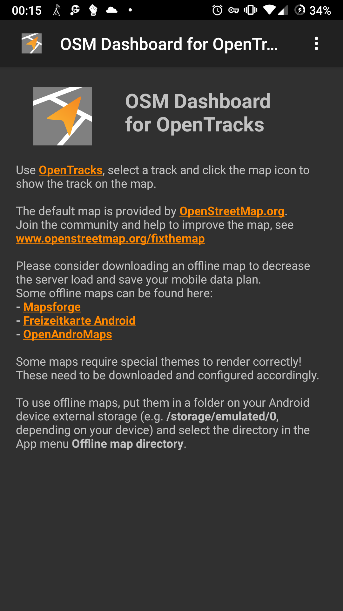
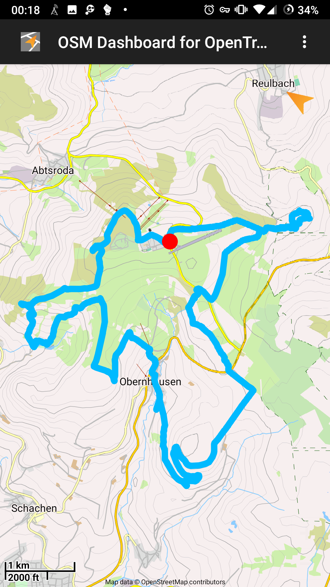
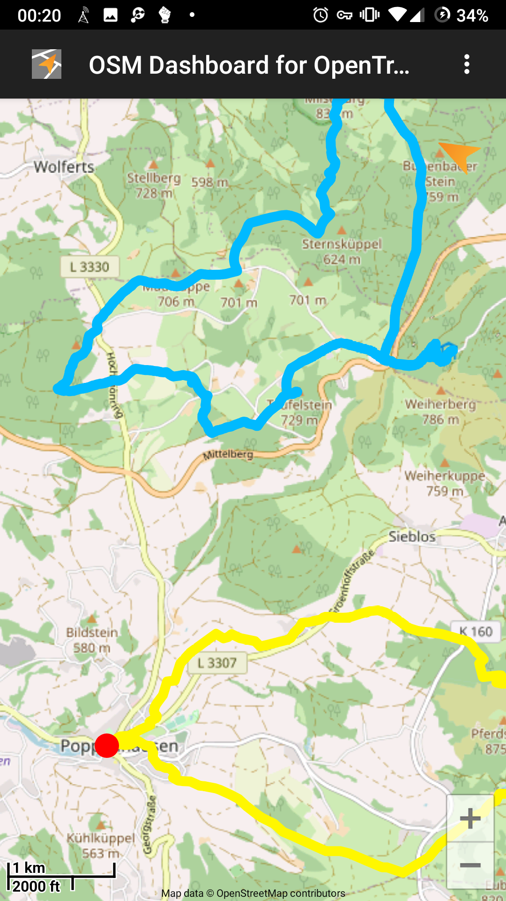
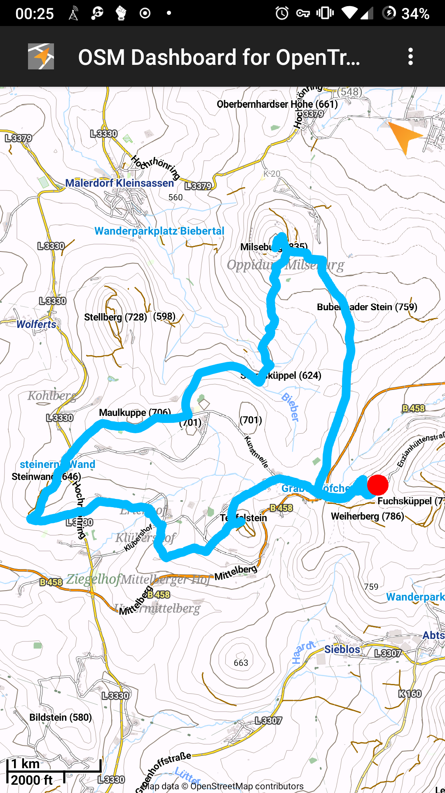
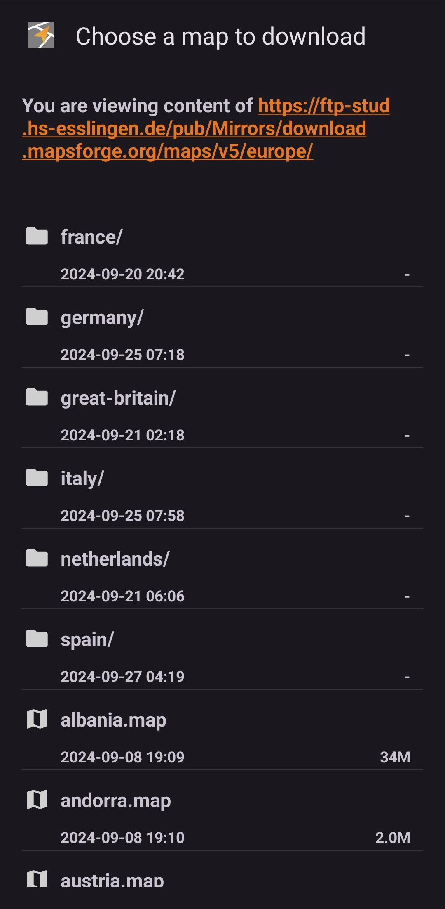
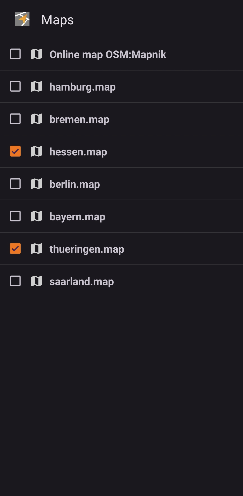

# </img>OSM Dashboard for OpenTracks

_OSM Dashboard_ is a companion application
for [OpenTracks](https://github.com/OpenTracksApp/OpenTracks).
It adds the functionality to show tracks on a map using data
from [OpenStreetMap](https://www.openstreetmap.org).
OSM Dashboard updates the provided data from OpenTracks in real-time.

<table>
    <tr>
        <th>Free</th>
        <th>Free (Offline)</th>
        <th>Free</th>
        <th>Free Nightly Build</th>
        <th>Translation</th>
    </tr>
    <tr>
        <td>
            
             
                        
        </td>
        <td>
            
             
                        
        </td>
        <td>
            
        </td>
        <td align="center">
            
        </td>
        <td>
            <a href="https://translate.codeberg.org/projects/open-tracks-osm-dashboard/">
                translate.codeberg.org
            </a> 
            
        </td>
    </tr>
</table>

## Features:

* _Online map data_: download map data on-demand
* _Offline map data_: use on-device stored map data
* _In app download of offline maps_: download offline maps from within the app,
  from [https://ftp-stud.hs-esslingen.de](https://ftp-stud.hs-esslingen.de/pub/Mirrors/download.mapsforge.org/maps/v5/)
* _Map themes_: support for custom map themes for offline maps

__Required permissions:__

* _INTERNET_: required for online maps (only required for the full version, the pure offline version
  doesn't need any permission)

## Maps

The map implementation is based on the [Mapsforge VTM](https://github.com/mapsforge/vtm) library.
This also defines the types of offline maps which can be used.

The default online map is provided by [OpenStreetMap.org](https://openstreetmap.org).
Join the community and help to improve the map,
see [www.openstreetmap.org/fixthemap](https://www.openstreetmap.org/fixthemap).

Please consider downloading an offline map to decrease the server load and save your mobile data
plan. Some offline maps can be found here:

- [Mapsforge](http://download.mapsforge.org/)
- [Freizeitkarte Android](https://www.freizeitkarte-osm.de/android/en/)
- [OpenAndroMaps](https://www.openandromaps.org/en)

**Some maps require special themes to render correctly!** These need to be downloaded and configured
accordingly.

Offline maps can be downloaded via the menu `Map download` or by visiting the above mentioned
websites and clicking the download links. Some browsers (e.g. Firefox) require a long click on the
link and "Open link in external app" and then choose OSMDashboard.

Manually downloaded offline maps or maps shared by other apps can be opened from your Android
device. Select the directory in the menu `Map directory`.

## Screenshots

    
    
    
    
    
    
    

